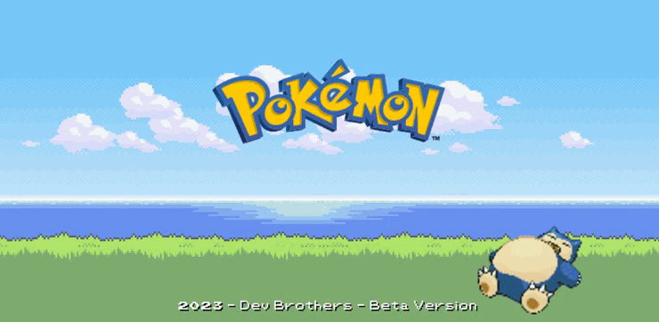

    <h1> SEJAM BEM VINDOS A POKÉDEX </h1>

   

 

### Tópicos 

- [Descrição do projeto](#descrição-do-projeto)

- [Funcionalidades](#funcionalidades)

- [Aplicação](#aplicação)

- [Ferramentas utilizadas](#ferramentas-utilizadas)

- [Acesso ao projeto](#acesso-ao-projeto)

- [Abrir e rodar o projeto](#abrir-e-rodar-o-projeto)

- [Desenvolvedores](#desenvolvedores)

 

## Descrição do projeto 

 Projeto em desenvolvimento para colocar em prática as tecnologias que estamos estudando.

  

## Funcionalidades

:heavy_check_mark: `Funcionalidade 1:` Realizar busca de informações dos pokémons, podendo ser por ID ou nome.

:heavy_check_mark: `Funcionalidade 2:` Botões "prev" e "next" que auxiliam na busca pelos pokémons.

:heavy_check_mark: `Funcionalidade 3:` Ligar e Desligar a Pokédex.

 

## Aplicação

###

 

## Ferramentas utilizadas
&nbsp;
&nbsp;
&nbsp;
&nbsp;
###

 

## Acesso ao projeto

Você pode [acessar o código fonte do projeto](https://github.com/DevLuigi/Pokedex) ou [acessa-lo](https://euphonious-kringle-8cd526.netlify.app/pokedex).

 

## Abrir e rodar o projeto

Após baixar o projeto, você pode abrir com o `Visual Studio Code`. 

- Abra a pasta onde o projeto está localizado, através dos botões `File >> Open Folder`;
- Após abrir a pasta, abra o seu terminal e rode o comando `npm start`.

Depois de realizar esse passo a passo, o `Visual Studio Code` irá abrir o projeto no seu Browser para você. 🏆 

 

## Desenvolvedores

| [ Luigi da Silva Coelho](https://github.com/DevLuigi) |  [ Kaio da Silva Coelho](https://github.com/Kaio-Silva)  |
| :---: | :---: 

